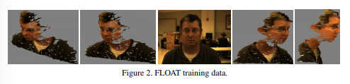

# Integrating Vision for Human-Robot Interaction

## Abstract

* HRI more than robust people detection and tracking.
* Relies on disparate scene information from tracking and recognition systems combined with current and prior knowledge to facilitate robotic understanding and interaction with humans in the environment.
* Development and integration of visual scene processing.

## Introduction

* Integration of people detection and tracking methods important. Requires both:
    1. Low level computer vision systems
    2. High level reasoning to facilitate bidrectional flow of information.

* Producing 3D scene information. Scene elements are recognized and tracked in 3D.
    1. Information passing between tracking systems and the integration of gaze and body pose tracking.
    2. Used for isolating diectic gestures to a single point in space.
* Integrating Markov Logic Networks with vision systems to provide high level logical inference.

## Tracking Systems

* Team of tracking algorithms, can track at multiple scales and exchange information for error handling/correction.
    1. Long Range: Full Body tracking, models clothing color using an adaptive particle fitler for tracking one or more people moving within a scene.
    2. Closer, Conversational Range: body pose and position are tracked using optical flow based face tracker.

### Sensor System

* Range camera
    1. Time of Flight Camera ( TOF ): range imaging camera that resolves distance.

### Full Body Tracking

* Uses a hue based upper and lower body clothing model.
    1. TOF sensor not effective at recovering long range distances.
    2. Allows for tracking of distance people at ranges of 30 feet and beyond.

* Detects a person in robot FOV.
* Boosted cascaed of **Haar-like** features provide an image region for each person.
* Region split into upper-lower
    1. Regions compared seperately with surrounding background to develop a maximal discriminative color histogram for upper-lower.

* Particle filter used to estimate position and size for bounding regions of each person.
    1. Works for up to **5** people in real time.

* Person tracking system outputs indexed particle images that capture the positions for particles tracking each person.
* Particle images used with depth images to estimate person location and upper/lower body orientation.

### Body Pose Tracking

* Identifies and tracks users face, hands, elbows and extracts 3D coords for each.

#### Body Pose Person Detection

* When full body tracker actively tracking people, regions identified by particle image and within 12 feet of camera are searched for frontal faces.
* When not activated, system searchs FOV for faces within 8 feet.
* Face found, skin color learned by creating color histogram of the ellipse enclosed in the detected face region.
    1. Algo based on boosted cascade object detection algo ( Lienhart and Maydt )
    2. Implemented in OpenCV

* Outputs head, hand, elbow positions, used for object interactions.

#### Pose Tracking

* Initialized with face location and skin color histogram.
* Tracks skin colored regions corresponding to face and hands across frames.
* Many models use complex human models and stat frameworks to fit models to observed data.
    1. Models must be learned/estimated, computing parameters for many degrees of freedom very computationally expensive.

* Since Real Time, uses human body model in combination with skin color.
* Argyros algo ustilizes multiple hypothesis labeling to track skin colored regions in each frame.
* **READ THIS SECTION MORE**

### Face Tracking

* FLOAT ( Fast Linear Optical Appearance Tracker )
* Tracks faces and objects by comparing color images with a learned models in real time.
* Face tracking, persons face recorded in 3D using color and range data, compared against video stream to recover both 3D position and pose info.

    

* To recover position and orientation of face, stored model registered with an object located in video stream. **READ MORE**

## Integrated Tracking and Applications

### Integrated Tracking

* Long ranges, full body tracker detects a person. Out of range for race and body pose tracking ( no tracking done )

    

* Person approaches, full body tracker passes on person location to other trackers, who begin tracking

    

* Basically a combination of all 3 tracking systems in order to get an accurate track of the person.

### Applied Tracking

* Following 3D line from elbow to thehand out in the scene, robot may be able to discern object a person is pointing to.

## Scene Understanding

* Tracking and object recogniotion alone does not facilitate scene understanding.
* Need the ability to deal with conflicting data, error hypothesis and lost tracks.
* Also simultaneously integrating prior knowledge.
* Use Markov Logic Networks.

### Markov Logic Networks

* Logical representations of AI extremely adept at handling complexity and making inferences about the real world.
* Difficult in som cases information cannot be stated without uncertainty.
* MLN can fuse logical representation with statistical uncertainty.

* Logical representation includes people, actions and physical objects.
* Define relations between objects using first order logic
    1. First Order Logic: Subject and Predicate. Predicate modifies or defines the properties of the subject such as P(x)

* Use Markov networs to assign a weight to each relation in terms of relative importance.
* Formally a MLN is a set of formulas $F_i$ and associated real valued $\omega_i$ paired in the form L = ( F_i, w_i )

* The MLN with MAP inference finds the most probable state given evidence.
* Evidence provided by prior knowledge about subject and actions, and info from sensors.
* MLN uses info to return the state of the world that is most likely.
    1. For gesture resolution, the physical object to which subject refers to is inferred as part of this world.

* MLN learning can be performed generatively or discriminatively.

### MLN Modeling

* MLN used to make inferences about real world based on who is observed and what we have seen them interact with in the past.
* For training, several example scenarios used describing human knowledge about people and their interactions.
* Evaluation phase: state of world provided by vision systems.
    1. Face recognition engine tells us identity of person
    2. Body pose tracker and fiducial tracker tells us about interactions between people and objects.

* Person being tracked assigned an id
* Objects being tracked also assigned an id
* Diectic references to a phyiscal object
    1. ReferencesHammer( id )

* A person interacts with object in scene.