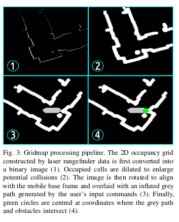
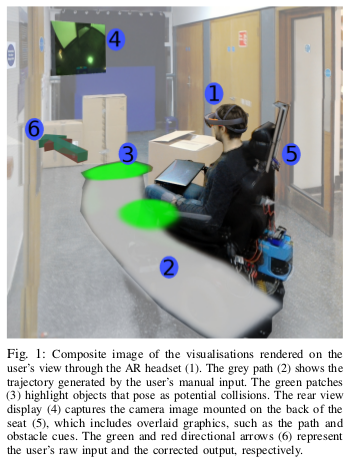

# Head-Mounted Augmented Reality for Explainable Robotic Wheelchair Assistance

Mark Zolotas: mark.zolotas12@imperial.ac.uk

## Abstract
* A novel augmented reality system using Microsoft Hololens as a headmounted aid for wheelchair navigation.
* Displays visual feedback of the underlying dynamics of the wheelchairs shared controller and its predicted future states.

## Introduction
* Shared control: Many noisy and unpredictable signals are produced by individuals with cognitive or motor impairments when operating joysticks. Shared control is a continous blending of the motor commands generated by a human operator and machine intelligence.
    * Example: Object avoidance
    * However, may disorient the user ( Something else taking control )
* Solution is to use immersive head mounted displays to help users overcome steep learning curve.
* This paper focuses on an augmented reality implementation

## Related Work
* Shared control policies complicated to implement. Need to consider users needs and demands.
* Object avoidance helps people operate the wheelchair, but also distorts the users perception of the capability of the system. No visual feedback to user from wheelchair.

* __Haptic Controllers__ are a group of feedback tools that emulate expert human assistance.
    * Circumvents the unnatural aspect of robotic autonomy and instead adjusts a drivers manual steering input onto a safer path via a remote human navigator (therapist)
    * Shared control policies can be derivaed from learning assistance by demonstration methodologies, so we can remove the remote human navigator in the long run.
* Problems and assumptions:
    * Internal plan of remote navigator doesn't perfectly agree with plan of primary user.
    * External navigator's commands not consistent and effective throughout session ( tired ). Results in misguided assistance.

* Immersive technologies encourage patients into building better mental models of the assistance.
    * AR exhibits enhanced navigation performance over VR.
    * Simulated VR not as effective as a mobile AR interface.

## Assistive Feedback Via Augmented Reality

### Shared Control
* Trajectory generation
* Obstacle Avoidance

#### Trajectory Generation
* Given a current odometry and an input velocity command
* Projects the robots state forward in time according to differential-drive kinematic constraints
* Output trajectory is validated for safety against an obstacle map.
    * Represented as a __polar histogram__
    * Incoming laser scans utilised to construct and update the state of map.
* Shared controller determines how best to assist a user based on binary output of collision checking routine.
    * No Collision: User input sent to wheelchair motors
    * Collision: obstacle avoidance process

### Gridmap Processing

* Represents environmental context from sensor data
    * Uses rangefinder data.
    * Identifies dangerous obstacles in surroundings.
    * Constructs an image view of this information to relay to user via AR.
* 4 Major Phases:
    1. Laser scan readings converted to 2d occupancy grid and translated into binary image.
    2. Image dilated to enlarge obstacle regions.
    3. Overlay a grey path onto image to capture the users desired route based on input trajectory
        * Represents a forward simulation of 2 seconds
    4. Greyscale image converted to RGB, green circles drawn at co-ordiates where grey path and obstacles overlap.
    
### Proposed Visualisations For Assistive Feedback
